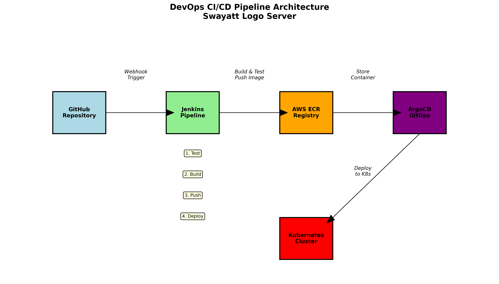

# DevOps CI/CD Pipeline - Swayatt Logo Server

A complete CI/CD pipeline implementation for a Node.js application using Jenkins, Docker, AWS ECR, ArgoCD, and Kubernetes.

## 🏗️ Architecture



```
GitHub → Jenkins → AWS ECR → ArgoCD → Kubernetes
   ↓        ↓         ↓        ↓         ↓
Webhook  Build/Test  Push   GitOps   Deploy
```

## 🛠️ Tech Stack

- **Application**: Node.js + Express
- **CI/CD**: Jenkins with shared libraries
- **Containerization**: Docker
- **Registry**: AWS ECR
- **Orchestration**: Kubernetes
- **Package Management**: Helm
- **GitOps**: ArgoCD
- **Version Control**: GitHub

## 🚀 Pipeline Stages

1. **Build**: Create Docker image
2. **Tag**: Tag image for ECR
3. **Push**: Upload to AWS ECR
4. **Deploy**: Update Helm chart, ArgoCD auto-syncs

## 📋 Setup Instructions

### Prerequisites
- Jenkins server with Docker and AWS CLI
- Kubernetes cluster with ArgoCD
- AWS ECR repository
- GitHub repository with webhook

### 1. Jenkins Configuration
```bash
# Required plugins: Pipeline, GitHub Integration, Docker Pipeline, AWS Steps
# Configure shared library:
# Manage Jenkins → Configure System → Global Pipeline Libraries
# Name: sharedlib
# Repository: https://github.com/NipurJain4/Jenkins_shared_liberary.git
```

### 2. Manual Build Trigger
- Builds are triggered manually from Jenkins UI
- Navigate to Jenkins → Your Job → "Build Now"

### 3. ArgoCD Application
```yaml
apiVersion: argoproj.io/v1alpha1
kind: Application
metadata:
  name: swayatt-logo-server
spec:
  source:
    repoURL: https://github.com/NipurJain4/DevOps-Task-Swayatt-helm_chart.git
    path: .
    targetRevision: main
  destination:
    server: https://kubernetes.default.svc
    namespace: default
```

## 🧪 Testing

```bash
# Run tests locally
npm install
npm test

# Run application
npm start
# Access at http://localhost:3000
```

## 📁 Repository Structure

```
├── app.js              # Main application
├── package.json        # Dependencies and scripts
├── Dockerfile          # Container definition
├── Jenkinsfile         # CI/CD pipeline
├── test/               # Unit tests
├── docs/               # Documentation and diagrams
├── deployment-proof/   # Deployment screenshots
└── WRITEUP.md         # Technical implementation details
```

## 🔗 Related Repositories

- **Shared Library**: [Jenkins_shared_liberary](https://github.com/NipurJain4/Jenkins_shared_liberary.git)
- **Helm Chart**: [DevOps-Task-Swayatt-helm_chart](https://github.com/NipurJain4/DevOps-Task-Swayatt-helm_chart.git)

## 📊 Monitoring

- Jenkins build logs and status
- ArgoCD application health and sync status  
- Kubernetes pod logs: `kubectl logs -f deployment/swayatt-logo-server`
- AWS ECR repository for image versions

## What is this app?

This is a lightweight Node.js application built with Express.js that serves a single logo image (`logoswayatt.png`) when accessed through a web browser. When you visit the root URL, the server responds by displaying the Swayatt logo.
